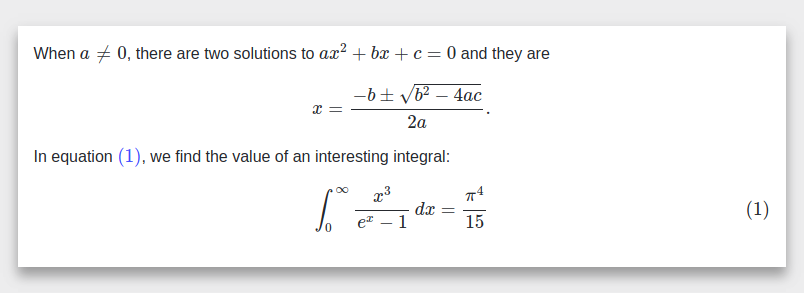

# MathJax Example

# Getting Started

    npm install
    npm start

To create the SVG output change the default 
config `MathJax.js?config=TeX-MML-AM_CHTML` 
to `MathJax.js?config=TeX-MML-AM_SVG`.
